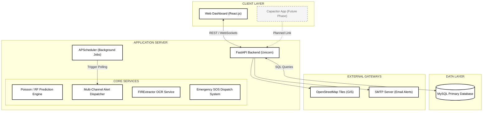
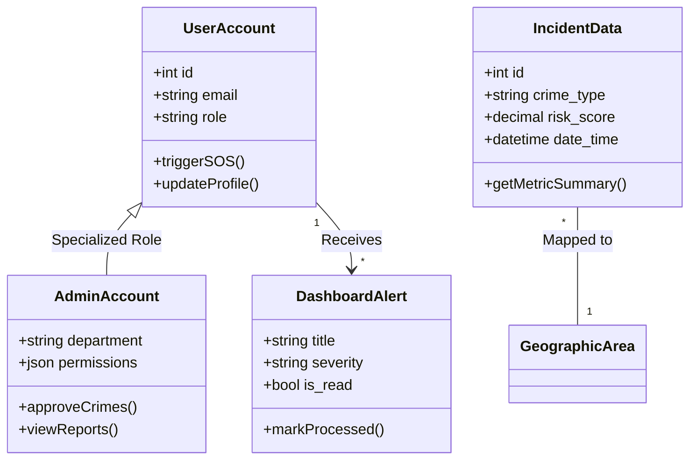
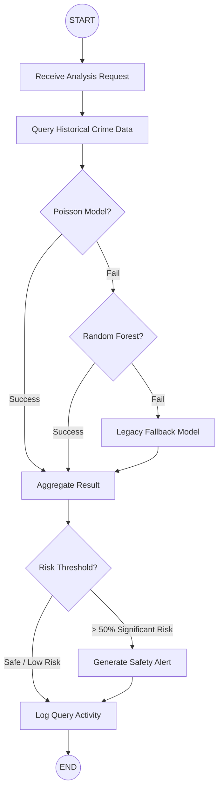
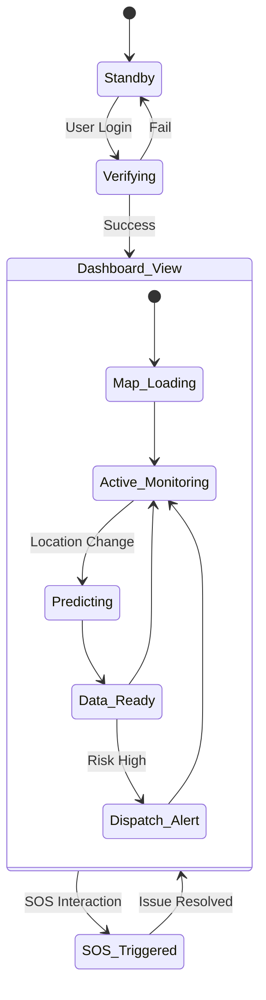
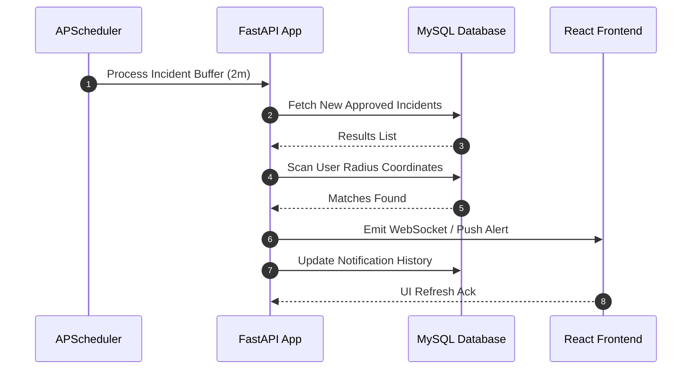
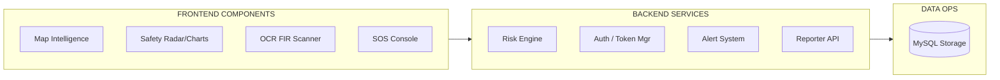
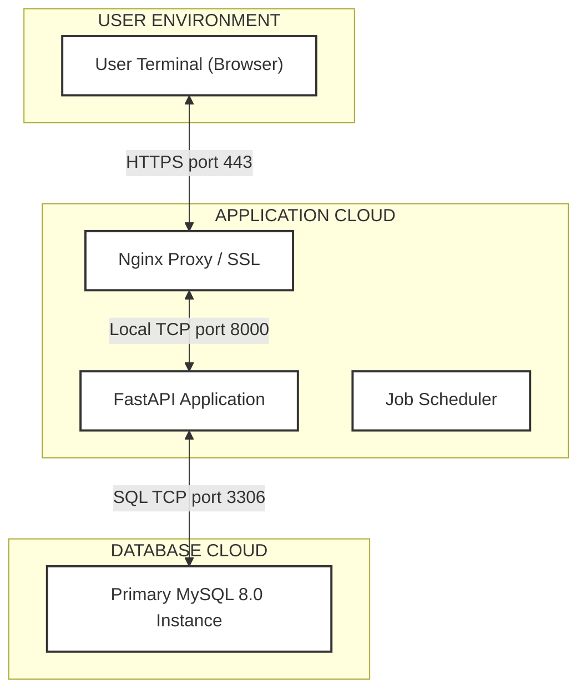
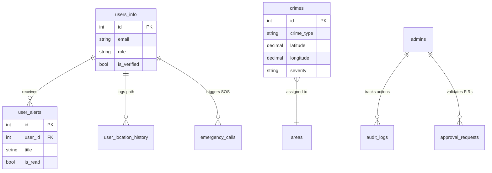
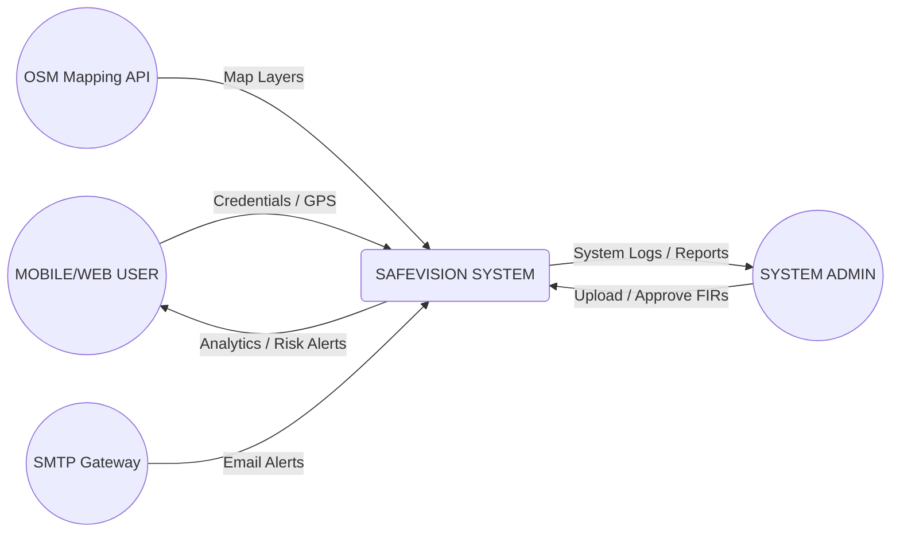

# SAFEVISION: Project Documentation Diagrams (v2.2)

This file contains 9 high-clarity, white-themed diagrams optimized for printing and documentation. These diagrams reflect the actual implementation of the SafeVision project while removing obsolete features (Community/Groups/Patrol) and marking the Mobile App as a future phase.

---

## 4.8: System Architecture
Vertical high-contrast layout for maximum readability.

---

## 4.9: Logical View (Class Diagram)
Reflects the core entities used in the Safety Analytics Dashboard.

---

## 4.10: Process View (Activity Diagram)
Workflow for risk prediction with model fallbacks.

---

## 4.11: System State Diagram
Transitions between major application states.

---

## 4.12: Sequence Diagram (Real-time Polling)
Messaging between background workers and the user interface.

---

## 4.13: Development View (Components)
Modular structure for build management.

---

## 4.14: Physical (Deployment) Diagram
Infrastructure mapping for production.

---

## 4.15: Entity Relationship Diagram (ERD)
Simplified schema focused on core features.

---

## 4.16: Context Diagram (DFD Level 0)
Highest level flow of data into and out of SafeVision.

---

> [!TIP]
> Ensure your markdown viewer supports **Mermaid** rendering to view these diagrams. From the viewer, you can export these as high-resolution images for your final Word/PDF documentation.
